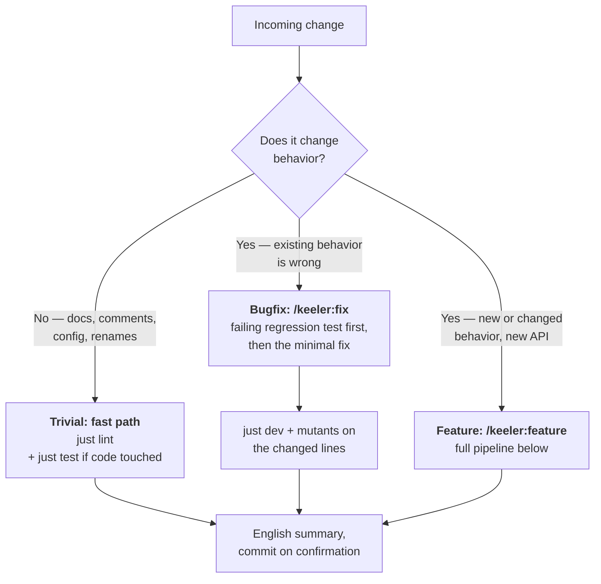
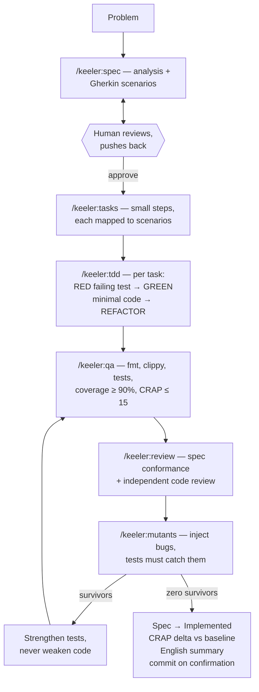

# Keeler — a Polygraph for AI-Written Code

**Keeler** is a way of building software *with* AI that stays trustworthy:
the human owns decisions, the agent does the labor, and machines — not
vibes — verify the result.

It is built for **[Claude Code](https://claude.com/claude-code)** and
**Rust**, and both are load-bearing rather than incidental. The pipeline
below is a set of Claude Code slash commands and skills; another agent
will not find them. Every gate is a Rust tool — `cargo nextest`,
`cargo llvm-cov`, `cargo mutants`, `cargo crap`, `proptest`.

The method carries over to any agent and any language with an equivalent
toolchain. This implementation does not, and saying otherwise would be the
kind of comfortable overclaim the gates below exist to catch.

It is named after **[Leonarde Keeler](https://en.wikipedia.org/wiki/Leonarde_Keeler)**, who built the first practical
polygraph (it's in the Smithsonian). A polygraph doesn't detect lies — it
records several independent physiological channels at once, on the theory
that you can fool one channel but not all of them. Keeler applies the same
theory to AI-generated code: plausible-looking output can fool a human
reader, but it cannot simultaneously fool the test suite, the coverage
profiler, the complexity score, an independent review, and mutation testing.

> **Verdicts.** Every task's final report ends with a one-line status:
> **PASS** (all gates green), **FAIL** (a gate failed — the report names
> which one), or **FLAKY** (unstable signal — rerun before trusting it).

## The one-paragraph version

Every feature starts as a **conversation, not code**: the AI analyzes the
problem and writes a short spec with concrete Given/When/Then scenarios. The
human reads it, pushes back, and **approves it** — that's the only moment
requirements get decided. From there the AI works test-first through small
tasks, and the result has to survive a gauntlet of mechanical gates: linting,
tests, coverage, a complexity-vs-coverage score (CRAP), an independent code
review, and finally **mutation testing** — a tool that deliberately breaks the
code to check whether the tests notice. If a mutant survives, the tests were
too weak; the fix is always a stronger test, never a code tweak to appease the
tool.

## Three roads: not every change is a feature

A pipeline nobody follows for small changes is a pipeline that gets bypassed
for big ones too. So the first question is always: *what kind of change is
this?*

Two honesty rules keep the classes meaningful:

- **Never downgrade mid-flight.** A change doesn't become "trivial" because a
  gate went red. If a trivial change breaks any test, it wasn't trivial —
  reclassify and take the proper road.
- **Bugs are reproduced before they are fixed.** `/keeler:fix` refuses to touch code
  until a regression test fails on the current build for the right reason. If
  the bug lives in behavior no spec covers, the spec gets a one-scenario
  amendment (human-approved) first — otherwise the fix would quietly encode a
  requirement nobody decided.

## The feature pipeline

The loop at the bottom right is the heart of it: a surviving mutant sends the
work back through QA with *stronger tests*, and the cycle repeats until the
suite catches every injected bug.

## Why each stage exists

| Stage                     | What it does                                                               | The AI failure mode it defends against                                               |
| ------------------------- | -------------------------------------------------------------------------- | ------------------------------------------------------------------------------------ |
| **/keeler:spec** + approval      | Problem analysis → Gherkin scenarios → human sign-off                      | AI confidently building the wrong thing; requirements drifting mid-implementation    |
| **/keeler:tasks**                | Spec broken into small ordered steps, each mapped to scenarios             | "Big bang" generation that's impossible to review; scenarios silently dropped        |
| **/keeler:tdd**                  | Red → green → refactor; the failing test is shown *before* the code exists | AI writing tests after the fact that merely describe what the code already does      |
| **/keeler:qa** (coverage + CRAP) | Every line of new code exercised; no function both complex and untested    | Plausible-looking generated code that nothing actually executes                      |
| **/keeler:review**               | Spec-conformance check + independent generic review                        | Scope creep; code that satisfies the letter of tests but not the spec                |
| **/keeler:mutants**              | Injects bugs; every one must be caught by a test                           | Assertion-free or tautological tests — the classic weakness of generated test suites |
| **CRAP delta**            | Compares scores before/after the feature                                   | Slow erosion: each change "fine", the codebase quietly getting worse                 |
| **/keeler:fix** (bugfix road)    | Failing regression test before any fix; minimal change after               | "Fixing" what was never reproduced; drive-by rewrites hiding inside a bugfix         |

The through-line: **at no point does "the AI said so" count as evidence.**
Specs are approved by a human; everything else is verified by a machine.

## The polygraph, literally

The metaphor is not decoration — every part of the workflow has an exact
counterpart in real polygraph practice:

| Keeler | Polygraph practice |
|---|---|
| Spec written, then **approved before any code** | Question review: the examinee sees and agrees the questions *before* the session — surprises invalidate the test |
| fmt / clippy | Instrument calibration |
| Unit & acceptance tests | Relevant questions |
| Coverage ("did anything exercise this line?") | A channel with no sensor attached records nothing — uncovered code is an unmonitored channel |
| CRAP score | Stress indicator: complex *and* untested is where deception hides |
| **Mutation testing** | **Control questions**: a known lie is planted and the sensors *must* react — if they don't, the instrument itself is broken and nothing it said can be trusted |
| `crap-baseline` / `crap-delta` | Baseline: examiners measure *deviation from baseline*, never absolutes |
| Final report with a PASS / FAIL / FLAKY status | The examiner's report |

The control-question row is the deepest part of the mapping: mutation
testing doesn't test the code, it tests the *tests* — exactly as control
questions don't probe the examinee, they probe the instrument.

## The moving parts

- `specs/` — one Markdown file per feature: context, Given/When/Then
  scenarios (these ARE the acceptance criteria), task checklist,
  implementation notes. Specs are law: the AI may not edit one without
  permission (only `Status:` and task checkboxes move as bookkeeping).
- `.claude/commands/` — one slash command per stage (`/keeler:spec`, `/keeler:tasks`,
  `/keeler:tdd`, `/keeler:qa`, `/keeler:review`, `/keeler:mutants`), plus `/keeler:feature` which runs the whole
  pipeline with a hard stop at spec approval, and `/keeler:fix` for the bugfix road.
- `.claude/keeler.md` — the standing rules the AI works under (imported by
  `CLAUDE.md`): the pipeline, change classes, quality bars, "never commit without confirmation", "every task
  ends with an English summary that re-surfaces discovered problems".
- `.claude/skills/` — knowledge that loads itself when relevant:
  **property-testing** (invariant catalog for the TDD and mutation stages)
  and **gherkin-specs** (scenario-writing rules for the spec stage). Global
  companions worth installing: rust-best-practices, clean-code,
  rust-async-patterns.
- `Justfile` — every gate as one short command (`just dev`, `just
  mutants-diff`, `just crap-delta`), so the human can re-run anything the AI
  claims.
- `.github/workflows/ci.yml` — the same gates in CI (installed as
  `keeler.yml` in your project): lints, tests,
  coverage ≥ 90%, CRAP ≤ 15, and mutation tests on the changed lines of every
  PR. Locally the law is discipline; in CI it's physics.

## Tests, three ways

1. **Unit tests** pin individual behaviors, next to the code.
2. **Property tests** (proptest) pin *invariants* — "display then parse always
   returns the same set", "output is always sorted and non-overlapping" —
   letting randomness hunt for the edge cases nobody thought to write down.
   When proptest finds a counterexample, its seed file under
   `proptest-regressions/` is committed: the found case is pinned forever.
3. **Acceptance tests** — one per spec scenario, named after it, so
   `grep` answers "is this scenario actually enforced?"

## What this looked like in practice

In the first real run of this pipeline (a port-range parser: `"80,443,8000-8100,22"` → canonical port set), the gates caught, mechanically, everything a tired reviewer
would miss:

- The CRAP gate flagged user-facing **error messages with 0% test coverage**.
- Mutation testing found `is_empty` was **unreachable through the public
  API** — dead branch, now pinned by a test.
- Mutation testing exposed a **redundant branch** in the merge logic
  (an equivalent mutant) — the code got *simpler* as a result.
- The pipeline itself had a hole: new untracked files escaped
  `mutants-diff`. Found, fixed.

None of those were noticed by reading the code. All of them were caught by
gates.
