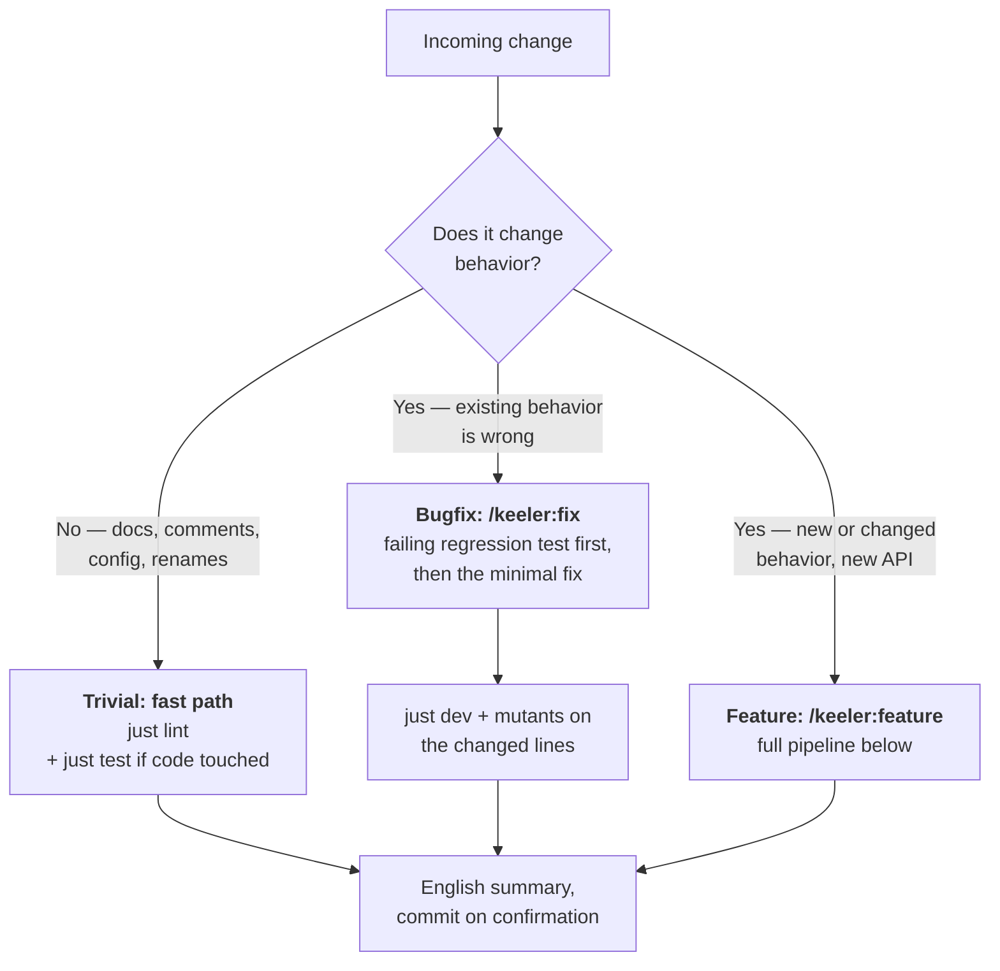
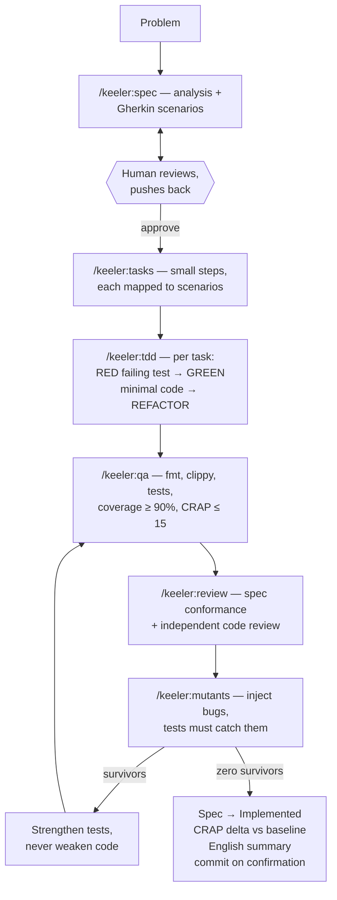
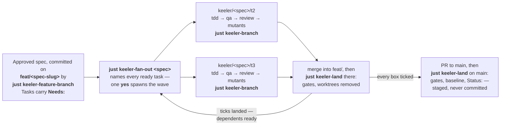

# Keeler — a Polygraph for AI-Written Code

**Keeler** is a way to build software *with* AI that remains trustworthy: humans own the decisions, the agent does the work, and machines — not vibes — verify the result.

It is built for **[Claude Code](https://claude.com/claude-code)** and
**Rust**, and both are load-bearing rather than incidental. The pipeline
below is a set of Claude Code slash commands and skills; another agent
will not find them. Every gate is a Rust tool — `cargo nextest`,
`cargo llvm-cov`, `cargo mutants`, `cargo crap`, `proptest`.

The method carries over to any agent and any language with an equivalent
toolchain — porting it means swapping the `Justfile` recipes and tool
names, and the pipeline and its rules stay the same. This implementation
does not carry over, and saying otherwise would be the kind of comfortable
overclaim the gates below exist to catch.

It is named after **[Leonarde Keeler](https://en.wikipedia.org/wiki/Leonarde_Keeler)**, who built the first practical
polygraph (it's in the Smithsonian). A polygraph doesn't detect lies — it
records several independent physiological channels at once, on the theory
that you can fool one channel but not all of them. Keeler applies the same
theory to AI-generated code: plausible-looking output can fool a human
reader, but it cannot simultaneously fool the test suite, the coverage
profiler, the complexity score, an independent review, and mutation testing.

This file is the *why*. Two others carry the rest, and neither repeats it:
Keeler's README is how to install it and what to type first, and
`.claude/keeler.md` — installed beside this file, in your project — is this
same workflow written as law for the agent: the file it actually reads while
it works.

> **Verdicts.** Every task's final report ends with a one-line status:
>
> - **PASS** (all gates green),
> - **FAIL** (a gate failed — the report names which one) or
> - **FLAKY** (unstable signal — rerun before trusting it).

## The one-paragraph version

Every feature starts as a **conversation, not code**: the AI analyzes the
problem and writes a short spec with concrete Given/When/Then scenarios. The
human reads it, pushes back, and **approves it** — that's the only moment
requirements get decided. From there the AI works test-first through small
tasks, and the result has to survive a gauntlet of mechanical gates: linting,
tests, coverage, a complexity-vs-coverage score (CRAP), an independent code
review, and finally **mutation testing** — a tool that deliberately breaks the
code to check whether the tests notice. If a mutant survives, the tests were
too weak; the fix is always a stronger test, never a code tweak to appease the
tool.

## Three roads: not every change is a feature

A pipeline nobody follows for small changes is a pipeline that gets bypassed
for big ones too. So the first question is always: *what kind of change is this?*

Two honesty rules keep the classes meaningful:

- **Never downgrade mid-flight.** A change doesn't become "trivial" because a
  gate went red. If a trivial change breaks any test, it wasn't trivial —
  reclassify and take the proper road.
- **Bugs are reproduced before they are fixed.** `/keeler:fix` refuses to touch code
  until a regression test fails on the current build for the right reason. If
  the bug lives in behavior no spec covers, the spec gets a one-scenario
  amendment (human-approved) first — otherwise the fix would quietly encode a
  requirement nobody decided.

## The feature pipeline

The loop at the bottom right is the heart of it: a surviving mutant sends the
work back through QA with *stronger tests*, and the cycle repeats until the
suite catches every injected bug.

## Graph mode: the same pipeline, in parallel

The pipeline above is one agent, one branch, stages in sequence. **Graph mode
runs that same pipeline several times at once** — one agent per task, each on
its own branch in its own worktree, each going through tdd → qa → review →
mutants for the single task it was handed. Every gate travels with it: qa
carries coverage and CRAP exactly as on the linear road, and the branch's
final gate is `just keeler-branch` — `dev`, then the CRAP delta against the
committed baseline, then mutants on the diff. Entirely opt-in: the linear
road is unchanged, and a project that never runs the recipes below never
meets them.

Three ideas carry all of it:

- **The spec is the contract.** Every spawned agent reads the approved spec,
  committed on the feature branch — that is what keeps five parallel agents
  building one feature instead of five.
- **The graph lives in the spec.** `/keeler:tasks` writes `Needs: T1.` on
  each task, so approving the spec is approving the graph. A task with no
  `Needs:` is ready at once — a spec written before graph mode existed reads
  as a graph whose every task is ready.
- **The gates decide when a branch is done.** Nobody watches an agent work:
  a task is finished when its gate ran green, its review record is committed
  and its box is ticked — and `keeler-land` checks all three, because a tick
  alone is the cheapest of the three to produce.

**A feature, start to finish** — the commands are the parts, this is the day:

1. `/keeler:spec`, iterate to approval, on any branch — exactly as always.
   On approval it asks which road; **graph** is the answer that starts this
   day. Answering "graph" is the human's consent for the one commit the next
   step makes, and for nothing else.
2. `just keeler-feature-branch <spec>` cuts `feat/<spec-slug>` from main and
   commits the approved spec there. `/keeler:spec` runs it for you on the
   "graph" answer; by hand it is the same thing.
3. `/keeler:tasks` writes `Needs:` into every task. **Commit the graph** —
   spawns read the committed spec, never the working tree.
4. `just keeler-fan-out <spec>` names every ready task; one **yes** spawns
   them all, each on its own branch, all in one tmux window with a pane per
   run. (`just keeler-spawn <spec> T3` hands out one task at a time instead.)
5. `just keeler-status <spec>` is the board while they run;
   `tmux attach -t keeler-<spec-slug>-t1` to watch one. `died` means a
   session ended before its gate — `just keeler-resume` picks up from the
   commits it left.
6. Merge each finished task branch into `feat/<spec-slug>` and run
   `just keeler-land` there: gates, then the landed worktrees are removed.
   Landed ticks unblock their dependents — back to step 4, until every box
   is ticked.
7. Pull request to main, merge, `just keeler-land` on main: it stages the
   refreshed baseline and `Status: Implemented`, and you commit.

Why these are `just` recipes and not slash commands: the pipeline's *stages*
are conversations with the agent, so they are slash commands — but spawning
agents, watching them and landing their work are the human's levers, and a
lever the agent could pull itself would be no consent at all. Inside a
Claude Code session you rarely type them: say "fan out the spec" or "what's
the board?" and the agent runs the same recipe — the recipe is what happens
either way, and the **yes** it asks for is yours.

| Command                                      | What it does                                                                                                                                                                     |
| -------------------------------------------- | -------------------------------------------------------------------------------------------------------------------------------------------------------------------------------- |
| `just keeler-feature-branch <spec>`          | Cuts `feat/<spec-slug>` from main, checks it out and commits the approved spec there — the "graph" answer's one mechanical step, and the same by hand                            |
| `/keeler:graph` — `just keeler-graph <spec>` | Ready / blocked / done, read from the spec on the feature's branch **`feat/<spec-slug>`**; a cycle or a dangling `Needs:` is refused by the parser                               |
| `just keeler-fan-out <spec>`                 | The wave: every ready task named, and one **yes** spawns them all through `keeler-spawn` — nothing starts that was not said yes to                                               |
| `just keeler-spawn <spec> <task>`            | Worktree + branch `keeler/<spec-slug>/<task-id>` + a headless agent in a detached tmux session                                                                                   |
| `just keeler-status <spec>`                  | The board: running, passed, incomplete, failed, died mid-pipeline, done, never spawned                                                                                           |
| `just keeler-resume <spec> <task>`           | Re-runs a task whose session died, in the worktree and branch it already has                                                                                                     |
| `just keeler-branch`                         | The gate a task branch runs instead of `just dev`: dev, then the CRAP delta vs the committed baseline, then mutants on the diff                                                  |
| `just keeler-land`                           | Fan-in, twice: gates first at both levels; on `feat/<spec-slug>` it then removes landed worktrees, on main the baseline and `Status: Implemented` — staged for a human to commit |

Three rules keep parallel branches honest, and CI enforces the first and
third on every `keeler/*` pull request:

- A branch **measures** the shared references — `crap-baseline.json`, the
  coverage bar — and never moves them; they settle at fan-in, on main.
- A branch ticks its own task and leaves the spec's `Status:` alone.
- Review leaves a committed record, `reviews/<spec-slug>/<task-id>.md`,
  naming the commit it examined. At a fan-in of five branches, "nobody
  noticed review was skipped" stops being a footnote.

Graph mode's one extra requirement is **tmux** — every spawned agent runs in a
detached session, which is what makes the runs both parallel and watchable.

## Why each stage exists

| Stage                            | What it does                                                               | The AI failure mode it defends against                                               |
| -------------------------------- | -------------------------------------------------------------------------- | ------------------------------------------------------------------------------------ |
| **/keeler:spec** + approval      | Problem analysis → Gherkin scenarios → human sign-off                      | AI confidently building the wrong thing; requirements drifting mid-implementation    |
| **/keeler:tasks**                | Spec broken into small ordered steps, each mapped to scenarios             | "Big bang" generation that's impossible to review; scenarios silently dropped        |
| **/keeler:tdd**                  | Red → green → refactor; the failing test is shown *before* the code exists | AI writing tests after the fact that merely describe what the code already does      |
| **/keeler:qa** (coverage + CRAP) | Every line of new code exercised; no function both complex and untested    | Plausible-looking generated code that nothing actually executes                      |
| **/keeler:review**               | Spec-conformance check + independent generic review                        | Scope creep; code that satisfies the letter of tests but not the spec                |
| **/keeler:mutants**              | Injects bugs; every one must be caught by a test                           | Assertion-free or tautological tests — the classic weakness of generated test suites |
| **CRAP delta**                   | Compares scores before/after the feature                                   | Slow erosion: each change "fine", the codebase quietly getting worse                 |
| **/keeler:fix** (bugfix road)    | Failing regression test before any fix; minimal change after               | "Fixing" what was never reproduced; drive-by rewrites hiding inside a bugfix         |

Behind the stages sit the gates themselves, and each catches what the
others miss:

| Gate       | What it catches                                               |
| ---------- | ------------------------------------------------------------- |
| Format     | style drift (`rustfmt`)                                       |
| Lints      | warnings and footguns (`clippy`, pedantic, zero tolerance)    |
| Tests      | broken behavior (`nextest` + doc tests)                       |
| Coverage   | untested lines in changed code                                |
| CRAP       | complex code hiding behind missing tests                      |
| Review     | scope creep, spec mismatches — and what no other gate can see |
| Mutation   | weak tests — bugs planted on purpose must be caught           |
| CRAP delta | any function getting worse than the committed baseline        |

One rule is absolute: **a surviving mutant means the test is weak.
Strengthen the test — never bend the code to satisfy the tool.**

The through-line: **at no point does "the AI said so" count as evidence.**
Specs are approved by a human; everything else is verified by a machine —
except review, which is the one stage a machine cannot do for you and the
one it cannot notice you skipping.

## The polygraph, literally

The metaphor is not decoration — every part of the workflow has an exact
counterpart in real polygraph practice:

| Keeler                                          | Polygraph practice                                                                                                                                             |
| ----------------------------------------------- | -------------------------------------------------------------------------------------------------------------------------------------------------------------- |
| Spec written, then **approved before any code** | Question review: the examinee sees and agrees the questions *before* the session — surprises invalidate the test                                               |
| fmt / clippy                                    | Instrument calibration                                                                                                                                         |
| Unit & acceptance tests                         | Relevant questions                                                                                                                                             |
| Coverage ("did anything exercise this line?")   | A channel with no sensor attached records nothing — uncovered code is an unmonitored channel                                                                   |
| CRAP score                                      | Stress indicator: complex *and* untested is where deception hides                                                                                              |
| **Mutation testing**                            | **Control questions**: a known lie is planted and the sensors *must* react — if they don't, the instrument itself is broken and nothing it said can be trusted |
| `crap-baseline` / `crap-delta`                  | Baseline: examiners measure *deviation from baseline*, never absolutes                                                                                         |
| Final report with a PASS / FAIL / FLAKY status  | The examiner's report                                                                                                                                          |

The control-question row is the deepest part of the mapping: mutation
testing doesn't test the code, it tests the *tests* — exactly as control
questions don't probe the examinee, they probe the instrument.

And every channel is blind to something. Tests measure the code you
wrote; mutants measure the tests; CRAP measures the shape of both. None
of them reads the spec, and none asks whether what the code produces is
valid by some authority outside the test. Review is the channel that can —
and the one that leaves no trace when skipped. The channels together catch
what one alone cannot, but only when all of them run.

## Two rules that make the rest hold

- **Specs are law.** The Given/When/Then scenarios in `specs/` *are* the
  acceptance criteria — every one maps to a test named after it, so `grep`
  answers "is this scenario enforced?" The agent may not edit a spec
  without permission; only the `Status:` line and task checkboxes move, as
  bookkeeping, and only at the end of the pipeline.
- **Every claim is re-runnable.** Every gate is one `just` recipe, so a
  human can rerun anything the agent says it did. Locally the law is
  discipline; in CI it's physics.

## Tests, three ways — and the test of the tests

1. **Unit tests** pin individual behaviors, next to the code.
2. **Property tests** (proptest) pin *invariants* — "display then parse always
   returns the same set", "output is always sorted and non-overlapping" —
   letting randomness hunt for the edge cases nobody thought to write down.
   When proptest finds a counterexample it writes a seed file, and that
   file is committed: the found case is pinned forever. (Where it lands
   depends on the crate — beside `lib.rs` when there is one, beside the test
   file otherwise; the rules file says how to configure the second.)
3. **Acceptance tests** — one per spec scenario, named after it, so
   `grep` answers "is this scenario actually enforced?"

**Mutation testing** is not a fourth kind. It is what checks the other
three. `cargo mutants` edits the code — flips a `<` to `<=`, replaces a
return value, deletes a branch — and runs the suite against each edit. A
test that still passes with the bug in place was never testing that line;
it was describing whatever the code happened to do. Every surviving mutant
is a claim the suite makes and cannot back, and the response is always a
stronger test, never a weaker mutant. `just mutants-diff` runs it on the
lines you changed; the whole crate is for a rainy afternoon.

What it can and cannot see is worth being exact about. It proves the tests
are sensitive to *the code you wrote*. It cannot tell whether they assert
the right thing — a test that counts substrings in a manifest instead of
parsing it will kill every mutant and still miss a manifest cargo refuses
to read. That is the gap review exists for.

## Skills: knowledge that loads itself

Two skills ship with Keeler and load themselves when the work calls for
them — no invocation, the description is the trigger: **property-testing**
carries the invariant catalog (round-trips, idempotence, ordering, bounds)
for the TDD and mutation stages, and **gherkin-specs** the scenario-writing
rules for the spec stage.

Recommended companions, installed on your machine rather than in the repo:
- **[rust-best-practices](https://github.com/apollographql/rust-best-practices)**
— borrowing vs cloning, `Result` handling, API design — for idiomatic Rust.
- **[clean-code](https://github.com/jackjin1997/ClawForge)** — naming, function
size, structure — for the refactor step.
- **[rust-async-patterns](https://github.com/search?q=rust-async-patterns+SKILL.md&type=code)**
— Tokio, async traits, concurrency — once the project grows async code.
- **[bulletproof-rust-web](https://github.com/minikin/claude-skills/blob/main/skills/bulletproof-rust-web/SKILL.md)**
— Axum, Tokio, SQLx and Tower: layering, domain types, error handling,
production hardening — only if what you are building is a web service.
