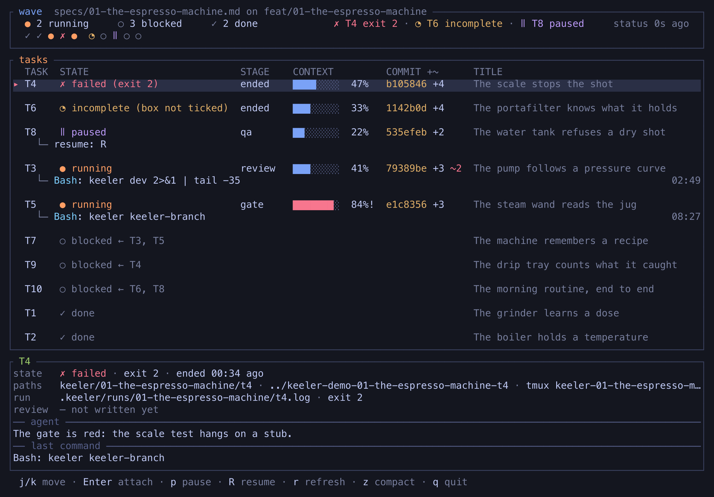

# Keeler

[](https://github.com/minikin/keeler/actions/workflows/ci.yml)
[](https://github.com/minikin/keeler/releases/latest)
[](LICENSE)

Keeler is a quality workflow for **Rust** projects built with
**[Claude Code](https://claude.com/claude-code)**. No code before a spec
you approved, no bugfix without a failing test first, and no change is done
until it passes a set of gates that check each other. It doesn't ask the
agent to be careful — it makes carelessness fail the build.

[](#the-board)

A feature's tasks can run as a wave of agents, one per task, each on its
own branch. [The board](#the-board) above is how you watch them.

> Named after [Leonarde Keeler](https://en.wikipedia.org/wiki/Leonarde_Keeler),
> who built the first practical polygraph. A polygraph does not detect lies;
> it records several independent channels at once, on the theory that you can
> fool one but not all of them.

**[docs/KEELER.md](docs/KEELER.md)** explains why the workflow is shaped this way.
It travels with the plugin, so the reasoning is one `/plugin` away rather
than a file in your repository.

## Install

**You need** a Rust toolchain, `bash`, `curl`, `tar` and `git` — the
workflow lives on branches; graph mode also needs `tmux`. Linux, or **macOS
12.3 and later**: the `keeler` wrapper resolves its own location with
`readlink -f`, which earlier macOS does not have. On Windows, WSL or Git
Bash. The gate tools themselves Keeler puts in for you, unless you pass
`--no-tools`.

Keeler is a Claude Code plugin, and this repository is its marketplace. In
Claude Code:

```
/plugin marketplace add minikin/keeler
/plugin install keeler@keeler
```

Then once per Rust project — existing or freshly `cargo new`-ed:

```
/keeler:init
```

`/keeler:init` runs the plugin's `install.sh` against the project. It lands
only what something other than the plugin has to read from your repository:
GitHub Actions reads the workflow from there and nowhere else, and clippy
and rustfmt read their configs from the directory they run in. `--no-tools`
skips the CLI tools, `--no-ci` the workflow.

|                  | What lands in your project                                                                                                 |
| ---------------- | -------------------------------------------------------------------------------------------------------------------------- |
| **CI**           | `.github/workflows/keeler.yml` — every gate, run from a Keeler fetched at the tag on its `KEELER_REF:` line, plus two checks that fire only on `keeler/*` pull requests: the baseline was not moved, the review record names a commit of the branch |
| **Tool configs** | `clippy.toml` and `rustfmt.toml` — read by their own toolchain, not by Keeler                                               |
| **Manifest**     | `proptest` as a dev-dependency, `[profile.mutants]`, `[lints.clippy]` — each only if missing                               |
| **Ignores**      | the gates' artifacts, appended to `.gitignore`; equivalent spellings are not duplicated                                    |
| **Tools**        | `cargo-nextest`, `cargo-llvm-cov`, `cargo-mutants`, `cargo-crap`, `just` — only the ones you lack; `--no-tools` skips this |

Everything else is the plugin's and stays there — the ten slash commands,
the two skills, the rules, the whole `Justfile`, the graph parser and
`docs/KEELER.md`. Your `CLAUDE.md` is never touched: the rules reach the
agent from a `SessionStart` hook, which speaks in any project holding a
`specs/*.md` and stays silent everywhere else. `/plugin update` upgrades all
of it in one move.

The installer keeps its hands off your files. Anything you already had is
never overwritten: if it differs from what Keeler ships, the new version
lands alongside as `<name>.keeler` and the run names it — except a workflow
that differs only by its `KEELER_REF:` line, which is you having repinned on
purpose and is left alone. Running it twice changes nothing. A directory
with no `Cargo.toml` it refuses outright; a manifest it edited and left
unreadable it puts back as it found it, and says so.

Outside Claude Code, `install.sh` is the same one-liner it has always been —
this is what `/keeler:init` runs for you:

```bash
# pin a release
KEELER_REF=v0.4.1 curl -fsSL https://raw.githubusercontent.com/minikin/keeler/main/install.sh | bash -s .

# or take main
curl -fsSL https://raw.githubusercontent.com/minikin/keeler/main/install.sh | bash -s .
```

Prefer to verify before running? Every release ships `install.sh` with its
SHA256:

```bash
gh release download v0.4.1 --repo minikin/keeler --pattern 'install.sh*'
sha256sum -c install.sh.sha256    # shasum -a 256 -c on macOS
bash install.sh .
```

### Migrating from an install.sh install

A project that adopted Keeler before the plugin existed still holds the
files the installer used to copy in. `/keeler:init` names them and stops
there:

```
Left by an earlier Keeler
  · .claude/commands/keeler
  · .claude/keeler.md
  · KEELER.md

  These are no longer installed — the plugin carries them. Nothing
  here was touched; in /path/to/project, remove them when you are ready:

    git rm -r -- .claude/commands/keeler .claude/keeler.md KEELER.md

  CLAUDE.md still imports the old rules: delete its @.claude/keeler.md line
  by hand. The rules now arrive at every session start, from the plugin.
```

Nothing is deleted for you: one of those files may have been edited on
purpose, and telling an edited copy from an untouched one would take every
released version at hand. Your `Justfile` is named too — but only if it
holds Keeler's recipes; a justfile of your own is never named, and never
read. Upgrading is `/plugin update` from here on — there is no recipe for
it, because there is nothing in your repository left to replace.

## The first day

Three roads, by weight of the change:

- **Feature** — `/keeler:feature <problem>` runs the whole pipeline: a spec
  you approve, then tests first, then the gates. Or stage by stage:
  `/keeler:spec → /keeler:tasks → /keeler:tdd → /keeler:qa → /keeler:review → /keeler:mutants`.
- **Bugfix** — `/keeler:fix`: a failing regression test first, then the
  minimal fix.
- **Trivial** — docs, comments, config: `keeler lint` and done.

### The recipes

The gates are plain `cargo` and `just`, so anything can run them — but the
`Justfile` lives in the plugin, so `just` inside your project answers
nothing. `keeler` is the spelling: a wrapper in the plugin's `bin/`, already
on the PATH of every Claude Code session where the plugin is enabled. For a
terminal of your own, put that `bin/` on your PATH — `/plugin` shows where
the plugin is installed — and **`keeler --list`** is the full list:

```bash
keeler test       # nextest + doc tests
keeler lint       # fmt --check + clippy -D warnings
keeler ci         # lint + test
keeler cov        # coverage summary (cargo-llvm-cov)
keeler crap       # coverage + CRAP gate (cargo-crap)
keeler crap-baseline    # record a CRAP baseline before a feature
keeler crap-delta       # CRAP before/after vs baseline; fails on regression
keeler dev              # fmt, lint, test, coverage, CRAP — the full fast gate
keeler mutants src/lib.rs   # mutation tests for one file
keeler mutants-diff         # mutation tests on the lines this branch changed
keeler dev-full   # dev + all mutants (slow)

# Graph mode (opt-in; see below)
keeler keeler-feature-branch specs/01-foo.md  # cut feat/01-foo and commit the approved spec there
keeler keeler-graph specs/01-foo.md           # ready / blocked / done
keeler keeler-fan-out specs/01-foo.md         # name every ready task; one yes spawns the wave
keeler keeler-spawn specs/01-foo.md T3        # hand one ready task to an agent on its own branch
keeler keeler-status specs/01-foo.md          # what each task is doing right now
keeler keeler-resume specs/01-foo.md T3       # re-run a task whose session died before its gate
keeler keeler-branch                          # the gate a task branch runs
keeler keeler-land                            # fan-in: worktrees on the feature branch, baseline and Status: on main
```

### Adopting it in an existing codebase

**Legacy code will not pass on day one — that's expected.** Run
`keeler crap-baseline` and **commit `crap-baseline.json`**: from then on
`keeler crap-delta` fails only on *regressions*, and CI enforces the same on
every pull request. Use `keeler mutants-diff` — changed lines only — never
full mutation testing on a legacy tree.

The two bars are yours to move, and there is no recipe of yours to edit —
the recipes read them from the environment:

| Variable          | What it sets                                          | Default |
| ----------------- | ----------------------------------------------------- | ------- |
| `KEELER_COV_MIN`  | `keeler cov`'s `--fail-under-lines`                   | 90      |
| `KEELER_CRAP_MAX` | the `--threshold` of `keeler crap` and `crap-delta`   | 15      |

In CI they are two commented-out `env:` lines at the top of
`.github/workflows/keeler.yml`; locally, export them in your shell. Set each
to where the project stands today and tighten it as the debt is repaid. The
gates guard the delta, not the past.

## Graph mode

A feature's tasks can run in parallel — one agent per task, each on its own
branch in its own worktree, each through the whole pipeline. The graph lives
in the spec: `/keeler:tasks` writes `Needs: T1.` on each task, so approving
the spec is approving the graph.

```
$ keeler keeler-fan-out specs/07-fan-out.md
keeler-fan-out: specs/07-fan-out.md on feat/07-fan-out
  T1 done
  T2 ready
  T3 ready
  T4 blocked (waiting on T2)
wave: T2 T3
spawn T2 T3? [yes/no] yes
```

One yes spawns them all, into one tmux window with a pane per run. Then
`keeler keeler-top <spec>` watches them (below), you merge the finished
branches into the feature branch, and `keeler keeler-land` runs the gates
and clears the landed worktrees.

It is opt-in and changes nothing on the linear road: a project that never
runs these recipes never meets them. Its one extra requirement is **tmux**.
[docs/KEELER.md](docs/KEELER.md#graph-mode-the-same-pipeline-in-parallel) has the day,
start to finish.

## The board

```bash
keeler keeler-top specs/01-the-espresso-machine.md
```

Nobody watches an agent work, but somebody has to know which of ten needs
them. The board reads what graph mode already writes — the same report
`keeler keeler-status` prints, each run's `stream-json`, and each task's
branch — and redraws itself:

- **the wave** — how many are running, blocked and done, then the ones that
  need a human, then a glyph per task;
- **the tasks** — one row each: state, stage, how much of its context window
  the run has spent, its commit and dirty count, and what the spec calls it.
  A running row names the command it is in underneath;
- **the selected task** — its branch and worktree, its log, its review
  record, the agent's own last words, and the last command it ran.

`j`/`k` move, `Enter` attaches to that task's tmux session, `p` pauses a
run and `R` resumes one, `r` re-reads, `z` collapses the rows to one line
each, `q` quits.

The board is a Rust binary the plugin builds from its own tree: the first
launch compiles it, which takes a few minutes, and every launch after is
instant. `--once` prints one frame as plain text for a script or a diff,
and needs no terminal. On a terminal that cannot draw the glyphs, set
`KEELER_TOP_ASCII=1`.

## Skills

The plugin ships two, and they load themselves — a skill fires on its
`description:` matching the work at hand, with no invocation:

- **property-testing** — invariant catalog and proptest patterns; fires
  during `/keeler:tdd` and when a surviving mutant points at a missing law
  rather than a missing example.
- **gherkin-specs** — how to write observable, testable Given/When/Then
  scenarios; fires during `/keeler:spec` and the conformance half of
  `/keeler:review`.

**Worth having beside them**, for a Rust project on this workflow — these
are yours to install, not Keeler's to ship:

- **rust-best-practices** — idiomatic Rust: borrowing vs cloning, `Result`
  error handling, API design; consulted while writing or refactoring any
  Rust code.
- **clean-code** — naming, function size, structure; the go-to during the
  REFACTOR step of `/keeler:tdd`.
- **rust-async-patterns** — Tokio, async traits, concurrency; the moment the
  project grows async code.
- **bulletproof-rust-web** — Axum/Tokio/SQLx/Tower architecture, error
  handling and production hardening; only when the project is a web service.

## What Keeler is not

- **Not for other agents.** It is a Claude Code plugin — commands, skills
  and a `SessionStart` hook are that tool's format and nobody else's. The
  *method* is portable and the gates are plain `cargo` and `just`, which
  anything can run — but the pipeline assumes Claude Code.
- **Not a substitute for review.** Every gate leaves evidence except
  review, so nothing notices when review is skipped. The commands lead from
  each stage to the next; following them is on you.
- **Not able to write its own instructions.** A spawned agent may not edit
  the plugin's own files — the commands, the skills, the rules — because a
  headless session has nobody to ask for that consent, so a task whose
  deliverable is one of them is the human's to do. Found the hard way, by a
  spawned agent that reported it rather than routing around it.
- **Not Windows-native.** The installer is a shell script — WSL or Git
  Bash — and the shipped gates have no Windows CI job behind them.

## Toolchain

- [just](https://github.com/casey/just) — task runner
- [cargo-nextest](https://nexte.st) — test runner
- [cargo-llvm-cov](https://github.com/taiki-e/cargo-llvm-cov) — coverage
- [cargo-crap](https://github.com/minikin/cargo-crap) — CRAP score gate (complexity × uncoverage)
- [cargo-mutants](https://mutants.rs) — mutation testing
- [proptest](https://proptest-rs.github.io/proptest/) — property-based tests

## Documentation

Each file says one thing once, and points at the others rather than
repeating them:

| File                                       | Written for                       | What it answers                                                                       |
| ------------------------------------------ | --------------------------------- | ------------------------------------------------------------------------------------- |
| **README.md**                              | you, right now                    | What is this, how do I install it, what do I type first                               |
| **[docs/KEELER.md](docs/KEELER.md)**       | your team                         | *Why* each stage and gate exists, what AI failure mode each one catches, the graph-mode day start to finish |
| **[keeler.md](keeler.md)**                 | the agent, every session          | The workflow as law: the pipeline, the change classes, the commit rule, the specs rule |
| **[graph-mode.md](graph-mode.md)**         | the agent, on instruction         | The parallel road: the recipes, the rules that keep parallel branches honest, a feature start to finish |
| **[gates.md](gates.md)**                   | the agent, on instruction         | The gate table, the bars, and the baseline discipline                                  |
| **[CONTRIBUTING.md](CONTRIBUTING.md)**     | contributors to Keeler itself     | Which road a change takes here, the release checklist, the standing review debt        |
| **[SECURITY.md](SECURITY.md)**             | anyone about to pipe curl to bash | What the installer trusts, what it never overwrites, how to report a hole              |
| **[CHANGELOG.md](CHANGELOG.md)**           | upgraders                         | What each release changed, and what it broke                                           |

`docs/KEELER.md`, `keeler.md`, `graph-mode.md` and `gates.md` travel with
the plugin — the reasoning and the rules reach you without a file landing in
your repository. The rest stay here.

## This repository

Both the product and its test bench:

- `install.sh` — the deliverable
- `templates/keeler.yml` — the CI workflow adopters receive
- `.claude-plugin/`, `commands/`, `skills/`, `keeler.md`, `graph-mode.md`, `gates.md` — the plugin itself, which this repository is
- `templates/spec.md` — the spec template `/keeler:spec` copies, and what starts yours
- `specs/` — the Gherkin specs this repository is built from
- `xtask/` — the release tooling: `cargo xtask release-guard`, `release-notes`, `checksum`, `plugin-check`
- `scripts/integration-check.sh` — the contract checker CI runs against pinned clones of anyhow, serde and ripgrep
- `tests/` — the harness that drives `install.sh` against generated projects, offline

## License

MIT — see [LICENSE](LICENSE). Contributions follow Keeler's own workflow;
[CONTRIBUTING.md](CONTRIBUTING.md) says which road yours takes.
